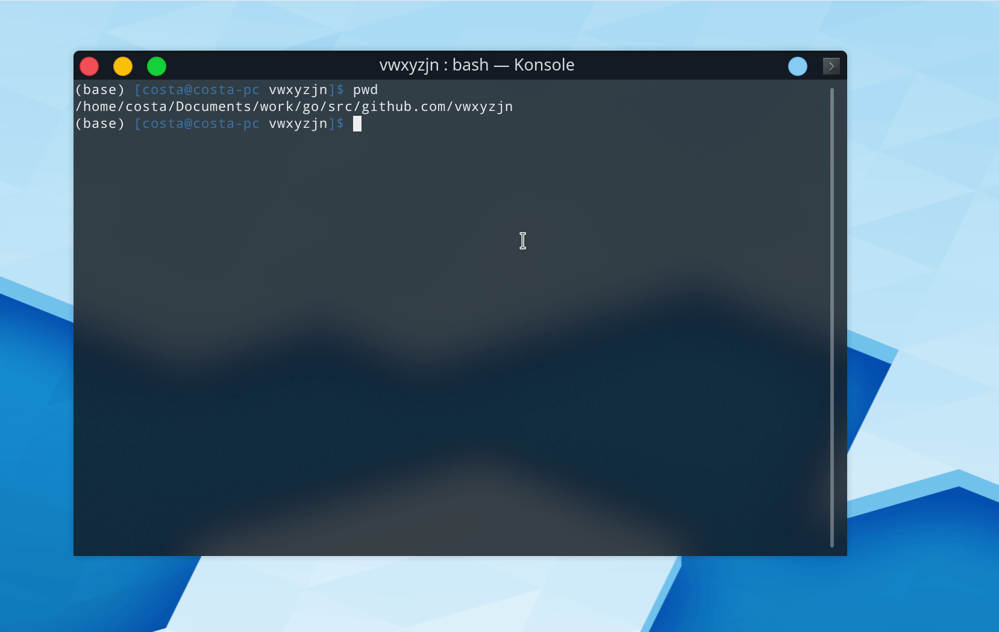

# Gym-MicroRTS

This repo contains the source code for the gym wrapper of MicroRTS authored by [Santiago Ontañón](https://github.com/santiontanon/microrts). 

# Get Started

Go to [http://microrts.s3-website-us-east-1.amazonaws.com/microrts/artifacts/](http://microrts.s3-website-us-east-1.amazonaws.com/microrts/artifacts/) to download the latest version of MicroRTS build. For example:

```bash
$ rm ~/microrts -fR && mkdir ~/microrts && \
wget -O ~/microrts/microrts.zip http://microrts.s3.amazonaws.com/microrts/artifacts/202008100000.microrts.zip && \
unzip ~/microrts/microrts.zip -d ~/microrts/ && \
rm ~/microrts/microrts.zip
```

Then clone the repo

```bash
$ git clone https://github.com/vwxyzjn/gym-microrts.git && \
cd gym-microrts && \
pip install dacite && \
pip install -e .
$ python3 hello_world.py
```

And run either the `hello_world.py` referenced above or the following file
```python
import gym
import gym_microrts

env = gym.make("MicrortsGlobalAgentsProd-v0")
env.reset()
for _ in range(10000):
    env.render()
    env.step(env.action_space.sample())
env.close()
```


## Papers written using gym-microrts

* Comparing Observation and Action Representations for Deep Reinforcement Learning in MicroRTS (https://arxiv.org/abs/1910.12134)
    * Logged experiments https://app.wandb.ai/costa-huang/MicrortsRL


