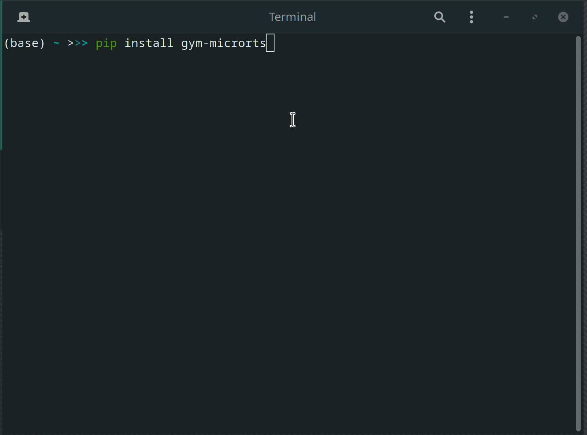

# Gym-MicroRTS

[](https://discord.gg/5tHykF)


This repo contains the source code for the gym wrapper of MicroRTS authored by [Santiago Ontañón](https://github.com/santiontanon/microrts). 

## Get Started

```bash
# Make sure you have Java 8.0+ installed
$ pip install gym_microrts --upgrade
```

And run either the `hello_world.py` referenced above or the following file
```python
import gym
import gym_microrts

env = gym.make("MicrortsMining-v1")
env.reset()
for _ in range(10000):
    env.render()
    env.step(env.action_space.sample())
env.close()
```


## Environment Specification

Here is a description of gym-microrts's observation and action space:

* **Observation Space.** Given a map of size `h x w`, the observation is a tensor of shape `(h, w, n_f)`, where `n_f` is a number of feature planes that have binary values. The observation space used in this paper uses 27 feature planes as shown in the following table. A feature plane can be thought of as a concatenation of multiple one-hot encoded features. As an example, if there is a worker with hit points equal to 1, not carrying any resources, owner being Player 1, and currently not executing any actions, then the one-hot encoding features will look like the following:

   `[0,1,0,0,0],  [1,0,0,0,0],  [1,0,0], [0,0,0,0,1,0,0,0],  [1,0,0,0,0,0]`
   

    The 27 values of each feature plane for the position in the map of such worker will thus be:
    
    `[0,1,0,0,0,1,0,0,0,0,1,0,0,0,0,0,0,1,0,0,0,1,0,0,0,0,0]`

* **Action Space.** Given a map of size `h x w`, the action is an 8-dimensional vector of discrete values as specified in the following table. The first component of the action vector represents the unit in the map to issue actions to, the second is the action type, and the rest of components represent the different parameters different action types can take. Depending on which action type is selected, the game engine will use the corresponding parameters to execute the action. As an example, if the RL agent issues a move south action to the worker at $x=3, y=2$ in a 10x10 map, the action will be encoded in the following way:
    
    `[3+2*10,1,2,0,0,0,0,0 ]`


## Developer Guide

Clone the repo

```bash
# install gym-microrts
$ git clone --recursive https://github.com/vwxyzjn/gym-microrts.git && \
cd gym-microrts && \
pip install -e .
# build microrts
$ cd gym_microrts/microrts && bash build.sh && cd ..& cd ..
$ python hello_world.py
```


## Papers written using gym-microrts

* Comparing Observation and Action Representations for Deep Reinforcement Learning in MicroRTS (https://arxiv.org/abs/1910.12134)
    * Logged experiments https://app.wandb.ai/costa-huang/MicrortsRL


